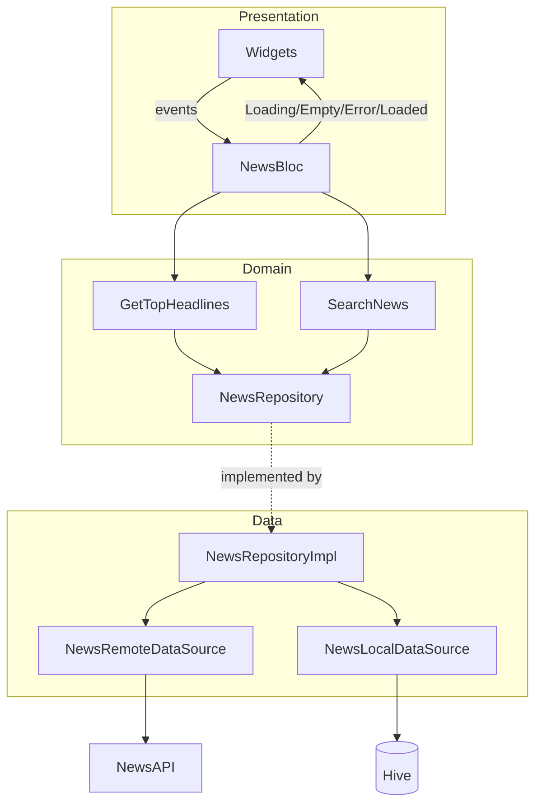

# News App Architecture Audit and Redesign Plan

## 1. Current Architecture Audit

### What Already Matches the Assignment

- **Clean Architecture layout**  
Feature-based structure with clear layers under `[lib/features/news/](lib/features/news/)`:
  - **Data:** `[data/datasources/](lib/features/news/data/datasources/)` (remote + local), `[data/models/article_model.dart](lib/features/news/data/models/article_model.dart)`, `[data/repositories/news_repository_impl.dart](lib/features/news/data/repositories/news_repository_impl.dart)`
  - **Domain:** `[domain/entities/article.dart](lib/features/news/domain/entities/article.dart)`, `[domain/repositories/news_repository.dart](lib/features/news/domain/repositories/news_repository.dart)`, `[domain/usecases/](lib/features/news/domain/usecases/)`
  - **Presentation:** `[presentation/bloc/](lib/features/news/presentation/bloc/)`, `[presentation/pages/](lib/features/news/presentation/pages/)`
- **State management**  
BLoC is used with distinct events and states; use cases are invoked from the BLoC, not from the UI.
- **Public REST API + pagination + detail**  
NewsAPI is used in the remote data source; top headlines use `page`/`pageSize`; infinite scroll and `[ArticleDetailPage](lib/features/news/presentation/pages/article_detail_page.dart)` exist.
- **Offline and caching**  
Local data source uses Hive (via `[NewsLocalDataSourceImpl](lib/features/news/data/datasources/news_local_data_source.dart)`); repository returns cached top headlines when offline and only caches page 1 of headlines.
- **Core abstractions**  
`[Failure](lib/core/error/failures.dart)` types, `[UseCase<Type, Params>](lib/core/usecase/usecase.dart)`, and `Either` from dartz are in place.

---

### Gaps to Fix for “Production-Ready” by Assignment Standards

| Requirement                                         | Current state                                                                                                                                                                                                                           | Change needed                                                                                                                                                                                  |
| --------------------------------------------------- | --------------------------------------------------------------------------------------------------------------------------------------------------------------------------------------------------------------------------------------- | ---------------------------------------------------------------------------------------------------------------------------------------------------------------------------------------------- |
| **No hardcoded secrets**                            | `[app_config.dart](lib/core/config/app_config.dart)` sets `defaultValue: '8d390201de914fc8a58d0b1fe2982d08'` for `NEWS_API_KEY`                                                                                                         | Remove default API key; load only from environment (e.g. `--dart-define=NEWS_API_KEY=...`) or from a secure config layer so prod has no fallback secret.                                       |
| **Explicit Loading / Empty / Error**                | States are `NewsInitial`, `NewsLoading`, `NewsLoaded`, `NewsError`. “Empty” is implied by `NewsLoaded(articles: [])`.                                                                                                                   | Introduce an explicit **Empty** state (e.g. `NewsEmpty` or a sealed union) so UI can handle “no data” and “no results” explicitly instead of overloading `NewsLoaded`.                         |
| **Robust offline cache (last successful response)** | Only first page of top headlines is cached; search is not cached and returns `ConnectionFailure` when offline.                                                                                                                          | Cache **last successful response** for both headlines and search (e.g. cache key per “screen” or per query); when offline, return cached data when available instead of only connection error. |
| **Dependencies**                                    | Code uses `flutter_bloc`, `equatable`, `get_it`, `hive_flutter`, `internet_connection_checker` but they are **not** in `[pubspec.yaml](pubspec.yaml)`.                                                                                  | Add these packages to `pubspec.yaml` with appropriate version constraints.                                                                                                                     |
| **Detail screen source**                            | `[article_detail_page.dart](lib/features/news/presentation/pages/article_detail_page.dart)` uses `article.source?.name`; domain `[Article](lib/features/news/domain/entities/article.dart)` has no `source`, only `name` (source name). | Use `article.name` (or introduce a small `Source` value object and map from model) so the detail screen reflects the entity correctly.                                                         |
| **Error handling in UI**                            | `[home_page.dart](lib/features/news/presentation/pages/home_page.dart)` checks `state.message.contains("No cached news")` for offline/empty-cache.                                                                                      | Prefer mapping **failure type** (e.g. `ConnectionFailure`, `CacheFailure`) to UI copy/actions instead of string matching.                                                                      |
| **Search pagination**                               | Search calls API without `page`/`pageSize`; assignment asks for pagination.                                                                                                                                                             | Add pagination to search (remote + repository + use case + BLoC events/states) and optionally cache last search result for offline.                                                            |

---

## 2. Redesign: Aligning to the Assignment’s Layered Structure

The following keeps your existing feature layout and makes the layers and behaviors match the assignment’s wording.

### Data Layer

- **API service (public REST)**  
Keep NewsAPI in a dedicated remote data source (already present). Ensure base URL and API key come only from config/env (no default key). Optionally extract a thin “API client” that only does HTTP and is configured with URL and key.
- **Local database for offline**  
Keep **Hive** as the local store. Extend the local data source so it:
  - Caches **last successful top-headlines response** (e.g. full list for page 1, or last N items).
  - Caches **last successful search response** (e.g. by a fixed key like `last_search` or by query) so offline search can show last result when available.
  - Exposes methods like `getCachedTopHeadlines()`, `getCachedSearchResults()`, `cacheTopHeadlines(...)`, `cacheSearchResults(query, articles)`.
- **Repository implementation**  
Update `[NewsRepositoryImpl](lib/features/news/data/repositories/news_repository_impl.dart)` to implement “last successful response” behavior:
  - **Top headlines:** On request, optionally return cached data first (if any), then fetch from network and replace cache on success; when offline, return cached data or `Left(CacheFailure(...))` if empty.
  - **Search:** On request with query, when online fetch and cache result; when offline, return cached search result if available, otherwise `Left(ConnectionFailure(...))` or `Left(CacheFailure(...))`.
  - Keep using `Either<Failure, List<Article>>` and avoid putting UI logic here.

### Domain Layer

- **Entities**  
Keep `[Article](lib/features/news/domain/entities/article.dart)` as the main entity. Fix the detail screen to use `article.name` (or add a minimal `Source` if you prefer). Domain must stay free of models and JSON.
- **Repository contract**  
Keep `[NewsRepository](lib/features/news/domain/repositories/news_repository.dart)` as the single abstract contract. If you add search pagination, extend with e.g. `searchNews(String query, int page)` and document that the implementation uses “last successful” cache when offline.
- **Use cases**  
Keep `GetTopHeadlines` and `SearchNews`; they only call the repository. Add a use case for “search with page” if you add search pagination (e.g. `SearchNewsPage` or extend params with `page`).

### Presentation Layer

- **State management (BLoC)**  
Keep BLoC. Adjust states so **Loading**, **Empty**, and **Error** are explicit:
  - **Loading:** `NewsLoading` (already present).
  - **Data:** `NewsLoaded(articles, hasReachedMax)` for non-empty list.
  - **Empty:** New state (e.g. `NewsEmpty` with optional reason: initial, no results for query, or cache empty when offline).
  - **Error:** `NewsError(message)` and ideally an optional `Failure` or error code so the UI can branch on failure type (connection vs server vs cache) instead of parsing messages.
- **Widgets**  
  - **Home:** Map states to: Loading → spinner; Empty → empty message/illustration; Error → message + retry (using failure type); Loaded → list + pagination.
  - **Search:** Same state mapping; add pagination UI/events if search is paginated.
  - **Detail:** Use `article.name` (or `Source`) for app bar title; keep the rest as-is.
- **No logic in UI**  
UI only dispatches events and maps states to widgets; no repository or use case calls from widgets.

---

## 3. Suggested Order of Work

1. **Secrets** – Remove default API key from `AppConfig`; document that `NEWS_API_KEY` must be provided via env/`--dart-define`.
2. **Dependencies** – Add `flutter_bloc`, `equatable`, `get_it`, `hive_flutter`, `internet_connection_checker` to `pubspec.yaml`.
3. **Explicit states** – Introduce `NewsEmpty` (or equivalent) and optionally carry `Failure` in `NewsError`; update BLoC and all `BlocBuilder` branches.
4. **Offline cache** – Extend local data source and repository to cache and return last successful response for both headlines and search; when offline, prefer returning cached data over failing.
5. **UI error handling** – Replace `state.message.contains(...)` with branching on failure type or error code.
6. **Detail screen** – Use `article.name` (or proper `Source`) in `ArticleDetailPage`.
7. **Search pagination** (optional but recommended) – Add `page` to search in data/domain/presentation and optionally cache last search result.

---

## 4. Diagram: Target Data and State Flow

This keeps your current Clean Architecture and BLoC setup, and only refines layers and behaviors to meet the assignment’s “production-ready” and “robust offline caching” criteria.